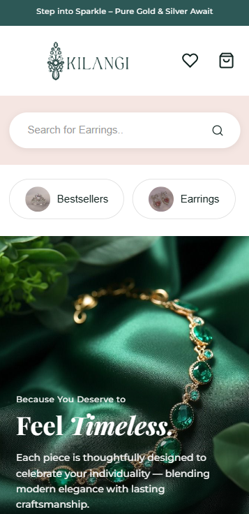

# Kilangi — Timeless Jewellery  

A modern, elegant e-commerce website for premium gold and silver jewellery collections. Features responsive mobile-first design with interactive elements and smooth user experience.

**By:** Stephanie Njonjo  
**Live Demo:** [Link to be added]  
**GitHub Repository:** https://github.com/Stephanieest/kilangi-mobile-website  

---

## Table of Contents
- [Overview](#overview)
- [Features](#features)
- [Screenshots](#screenshots)
- [Getting Started](#getting-started)
  - [View Online](#view-online)
  - [Run Locally](#run-locally)
- [Project Structure](#project-structure)
- [Technologies Used](#technologies-used)
- [Development Notes](#development-notes)
- [License](#license)
- [Contact](#contact)

---

## Overview

Kilangi is a premium jewellery brand website offering customers a seamless browsing experience to explore exquisite silver and gold collections. The site features a clean, modern design with intuitive navigation and interactive elements.

Users can:
- Browse jewellery collections (Rings, Earrings, Pendants, Bracelets, Necklaces, Bangles)
- Filter products by category using interactive tabs
- View bestsellers and recently viewed items
- Explore gift options for occasions (Birthday, Anniversary, Engagement)
- Learn about the brand's ethos and sustainable practices
- Read customer testimonials

---

## Features

### Core Functionality
- **Responsive Design**: Fully optimized for mobile, tablet, and desktop
- **Product Showcase**: Product cards with images, pricing, and options
- **Category Navigation**: Filtering with category tabs
- **Search Bar**: Quick product search functionality
- **Gift Sections**: Curated collections by price range and occasion
- **Interactive Elements**: Hover effects and smooth transitions

### Key Sections
1. **Hero Banner** - Compelling brand messaging
2. **Features Bar** - Key product benefits
3. **Bestsellers** - Top products with filtering
4. **Collection Gallery** - Visual category grid
5. **Recently Viewed** - Browsing history
6. **Gift Options** - Organized by occasion
7. **Brand Story** - Ethical sourcing and craftsmanship
8. **Testimonials** - Customer reviews with ratings

---

## Screenshots



*Main page showing product categories and featured items*

---

## Getting Started

### View Online
Visit the deployed site at: [Live URL to be added]

The live site allows you to:
- Browse all jewellery collections
- Search for specific items
- View product details and pricing
- Read customer testimonials
- Learn about brand values

### Run Locally

#### Prerequisites
- Modern web browser (Chrome, Firefox, Safari, Edge)
- Code editor (VS Code recommended)
- Basic understanding of HTML/CSS/JavaScript (for development)

#### Installation Steps
1. Clone the repository:
   ```bash
   git clone https://github.com/Stephanieest/kilangi-mobile-website
   ```

2. Navigate to the project directory:
   ```bash
   cd kilangi-jewellery
   ```

3. Open `index.html` directly in your browser, or use a local server:

   **Using Node.js (with http-server):**
   ```bash
   npx http-server
   ```

4. Open your browser and visit:
   ```
   http://localhost:8080
   ```

---

## Project Structure

```
kilangi-jewellery/
├── index.html              # Main application file
├── styles.css              # All CSS styles
├── script.js               # JavaScript functionality
├── logo.png                # Header logo
├── footerlogo.png          # Footer logo
├── screenshot.png          # Project screenshot
├── README.md               # This documentation
└── (other asset files)     # Images, icons, etc.
```

---

## Technologies Used

- **HTML5** - Semantic structure and content
- **CSS3** - Styling, responsive design, animations
- **JavaScript** - Interactive functionality
- **Google Fonts** - Montserrat and Playfair Display
- **SVG Icons** - Scalable vector graphics
- **Mobile-First Approach** - Responsive design principles

---

## Development Notes

### Key Design Decisions
1. **Mobile-First Approach**: Designed for mobile devices first, then scaled up
2. **Minimalist Aesthetic**: Clean layout with focus on product imagery
3. **Performance Focus**: Optimized assets for fast loading
4. **Accessibility**: Semantic HTML and ARIA labels where applicable

### Browser Compatibility
Tested and working on:
- Chrome 90+
- Firefox 88+
- Safari 14+
- Edge 90+

---

## License

MIT License

Copyright © 2025 Stephanie Njonjo

Permission is hereby granted, free of charge, to any person obtaining a copy of this software and associated documentation files (the "Software"), to deal in the Software without restriction, including without limitation the rights to use, copy, modify, merge, publish, distribute, sublicense, and/or sell copies of the Software, and to permit persons to whom the Software is furnished to do so, subject to the following conditions:

The above copyright notice and this permission notice shall be included in all copies or substantial portions of the Software.

**THE SOFTWARE IS PROVIDED "AS IS", WITHOUT WARRANTY OF ANY KIND, EXPRESS OR IMPLIED, INCLUDING BUT NOT LIMITED TO THE WARRANTIES OF MERCHANTABILITY, FITNESS FOR A PARTICULAR PURPOSE, AND NONINFRINGEMENT. IN NO EVENT SHALL THE AUTHORS OR COPYRIGHT HOLDERS BE LIABLE FOR ANY CLAIM, DAMAGES, OR OTHER LIABILITY, WHETHER IN AN ACTION OF CONTRACT, TORT, OR OTHERWISE, ARISING FROM, OUT OF, OR IN CONNECTION WITH THE SOFTWARE OR THE USE OR OTHER DEALINGS IN THE SOFTWARE.**

---

## Contact

**Stephanie Njonjo**  
Email: stephnjonjo@gmail.com 
Project Link: https://github.com/Stephanieest/kilangi-mobile-website

---

**Made with ❤️ for jewellery lovers worldwide**